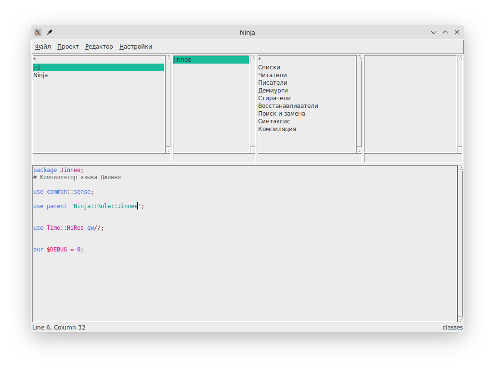

# NAME

**ninja** - редактор (IDE) в стиле Smalltalk, но для разных языков программирования

# VERSION

0.0.0-prealpha

# SYNOPSIS



# DESCRIPTION

**ninja** рекурсивно обходит список включений (INC) проекта, и определяет по расширению или первой строке (которая `#!/bin/<интерпретатор>`) язык на котором написан файл, и, тут же, парсит его, определяя неймспейсы, классы, категории и методы, которые в нём содержатся.

Данная информация кешируется в __~/.cache/ninja-editor/<проект>/<включение>/<путь к файлу относительно включения>__.

При переходе по секциям информация будет обновляться.

Парсинг файлов подсчитывает фигурные скобки (или их аналоги, например, `do`..`end` для __Ruby__ или `begin`..`end` для __Pascal-я__), однако если в скобках будут ошибки, то парсер восстановится основываясь на отступах.

# DEPENDENS

* perl-common-sense
* perl-data-printer
* perl-json-xs
* perl-tk

# INSTALL

```sh
$ git clone https://github.com/darviarush/ninja.git
$ cd ninja
$ perl ninja.pl
```

Для установки библиотек **perl** использующихся редактором выполните (только для дистрибутивов на основе **archlinux**):

```sh
$ sudo pacman -S perl-common-sense perl-json-xs perl-tk
$ sudo pikaur -S perl-data-printer
```

# RUN

Для запуска редактора:

```
$ ninja
```

При этом откроется окно со списком проектов.

Создать новый проект или открыть старый можно, запустив **ninja** в базовом каталоге c опцией ".".

```sh
$ cd my-project-repository
$ ninja .
```

# THESAURUS

Включениями называется список каталогов в которых производится рекурсивный поиск файлов.

Проект состоит из:

* Базового каталога. Этот каталог является базовым для .
* Списка включений. Такой список может содержать каталоги `src`, `lib` или вообще .
* Списка исключений для включений - предотвращает поиск в указанных каталогах, например, `.git`.
* Списка исключений расширений - файлы с указанными расширениями не будут парсится.

Секциями называются списки пакетов (неймспейсов), классов, категорий и методов.

* Секция пакетов служит для отображения неймспейсов для классов. Если же неймспейс не указан, то наименование пакета будет браться из части пути между включением и файлом. Например, `Ninja/tk`.
* Секция классов - отображает классы, но в смешанных и не ООП языках программирования, это будут так же модули. Например, для __C__, это будет название файла в котором находятся функции.
* Секция категорий содержит категории методов. Категория указывается специальным комментарием, например: `#@category Инициализация`.
* Секция методов показывает методы в выбранной категории. Методами так же считаются функции, макросы (`#define` в __С/С++__), процедуры и подпрограммы.

На самом деле что именно считать пакетами, классами, категориями и методами полностью зависит от гения (парсера) конкретного языка программирования.

# ARCHITECTURE

Архитектура **ninja** состоит из трёх основных элементов:

1. Отображения - то есть самого редактора.
2. Наблюдателя, который наблюдает за изменениями в дереве файловой системы от включений проекта.
3. Гениев - когда наблюдатель обнаруживает новый или изменённый файл, он определяет его тип и парсит соответствующим парсером (гением).

Отображение запрашивает у наблюдателя списки или изменение файлов. Наблюдатель поддерживает базу в соответствии с исходными текстами программы.

# AUTHOR

Yaroslav O. Kosmina <darviarush@mail.ru>
